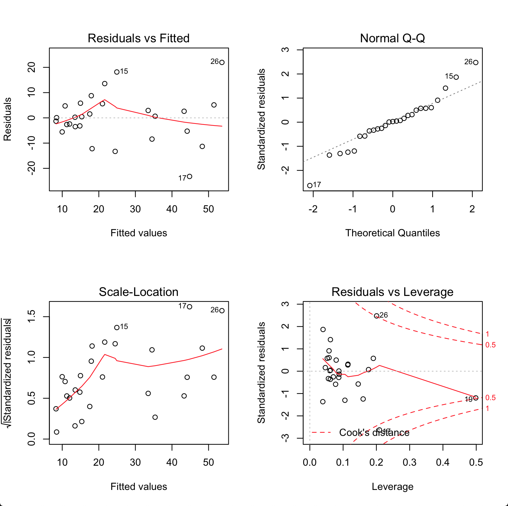
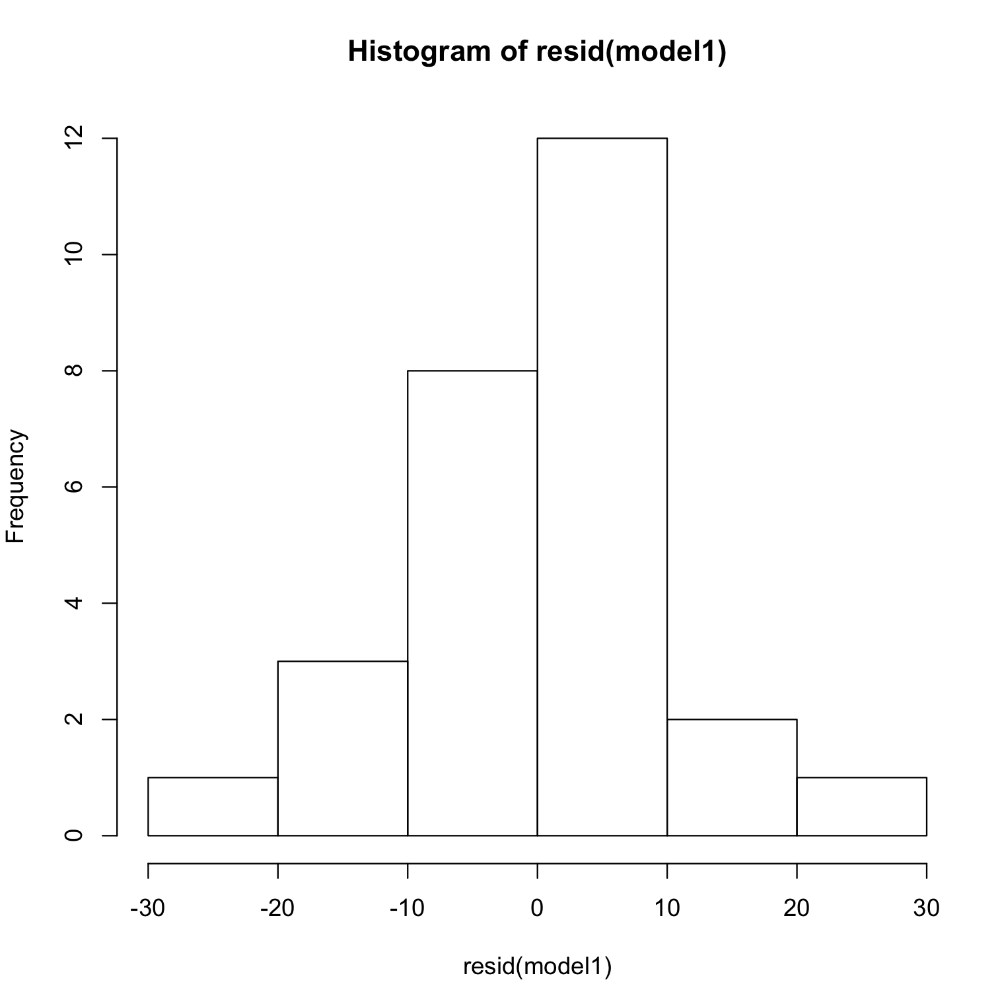
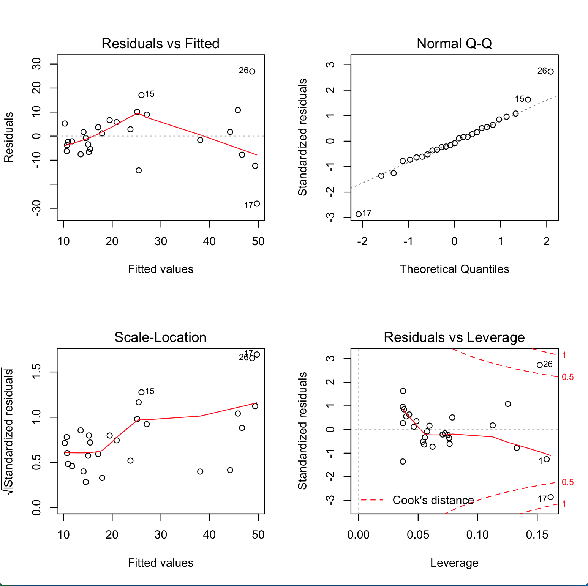
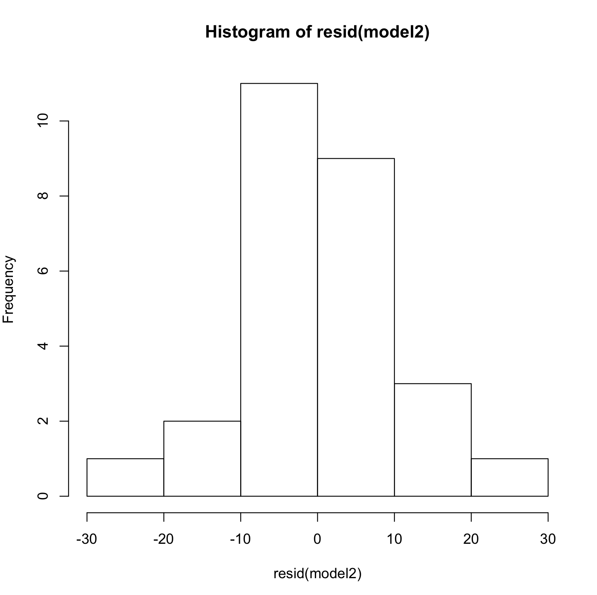

```R
# Read data from csv
data <- read_csv("TableB5.csv")

# Fit data to linear model
model1 <- lm(y ~ x6 + x7, data = data)

# Print the model summary
summary(model1)

## Output

# Residuals:
#      Min       1Q   Median       3Q      Max 
# -23.2035  -4.3713   0.2513   4.9339  21.9682 

# Coefficients:
#             Estimate Std. Error t value Pr(>|t|)    
# (Intercept) 2.526460   3.610055   0.700   0.4908    
# x6          0.018522   0.002747   6.742 5.66e-07 ***
# x7          2.185753   0.972696   2.247   0.0341 *  
# ---
# Signif. codes:  0 ‘***’ 0.001 ‘**’ 0.01 ‘*’ 0.05 ‘.’ 0.1 ‘ ’ 1

# Residual standard error: 9.924 on 24 degrees of freedom
# Multiple R-squared:  0.6996,    Adjusted R-squared:  0.6746 
# F-statistic: 27.95 on 2 and 24 DF,  p-value: 5.391e-07

# diagnostic plots of the linear regression fit
plot(hist(resid(model1)))
plot(density(resid(model1)))

par(mfrow = c(2, 2))
plot(model1)

# Refit the model for only x6
model2 <- lm(y ~ x6, data = data)

# Print the model summary
summary(model2)

# Residuals:
#     Min      1Q  Median      3Q     Max 
# -28.081  -5.829  -0.839   5.522  26.882 

# Coefficients:
#             Estimate Std. Error t value Pr(>|t|)    
# (Intercept) 6.144181   3.483064   1.764   0.0899 .  
# x6          0.019395   0.002932   6.616 6.24e-07 ***
# ---
# Signif. codes:  0 ‘***’ 0.001 ‘**’ 0.01 ‘*’ 0.05 ‘.’ 0.1 ‘ ’ 1

# Residual standard error: 10.7 on 25 degrees of freedom
# Multiple R-squared:  0.6365,    Adjusted R-squared:  0.6219 
# F-statistic: 43.77 on 1 and 25 DF,  p-value: 6.238e-07


# diagnostic plots of the linear regression fit
plot(hist(resid(model2)))
plot(density(resid(model2)))

par(mfrow = c(2, 2))
plot(model2)


pred_r_squared <- function(model, press) {
    anova <- anova(model)
    tss <- sum(anova$"Sum Sq")
    # predictive R^2
    pred_r_squared <- 1 - press/(tss)
    return(pred_r_squared)
}

press1 <- PRESS(model1)
press1
pred_r_squared(model1, press1)
# > press1 <- PRESS(model1)
# > press1
# [1] 3388.604
# > pred_r_squared(model1, press1)
# [1] 0.5694339

press2 <- PRESS(model2)
press2
pred_r_squared(model2, press2)
# > press2 <- PRESS(model2)
# > press2
# [1] 3692.881
# > pred_r_squared(model2, press2)
# [1] 0.5307715
```
---------------


## Model 1 : Diagnostic plots of the linear regression fit

- Plot 1:
  
<p align="left">
  
</p>

 - **Residuals vs Fitted:**
The plots are relatively shapeless and there is no linear pattern.

 - **Normal Q-Q:**
There does not seem to be a problem with normality as the plots are generally in a straight line.

 - **Scale-Location (or Spread-Location):** 
Since the variance of the residuals is not equally spread points the model has no homoscedasticity and has a heteroscedasticity problem.

- Plot 2:

<p align="left">
  
</p>

The residual errors of this model are normally distributed.

---------------


## Model 2 : Diagnostic plots of the linear regression fit

- Plot 1:
  
<p align="left">
  
</p>

 - **Residuals vs Fitted:**
The plot of residuals versus fitted values indicates a non-linear relationship in the data.

 - **Normal Q-Q:**
This model has its residuals normally distributed.

- **Scale-Location (or Spread-Location):** 
Since the variance of the residuals is not equally spread points the model no homoscedasticity and has a heteroscedasticity problem.

- Plot 2:

<p align="left">
  
</p>

The residual errors of this model are normally distributed.

---------------

## Insight regarding the best choice of model

When model has both x6 and x7
$$PRESS = 3388.6$$
$$R^2_{pred}=56.94\%$$

When model has only x6
$$PRESS = 3692.9$$
$$R^2_{pred}=53.08\%$$

The residual plots for both models show nonconstant variance and departure from normality. Hence there is no insight into the best choice of model.

---------------
