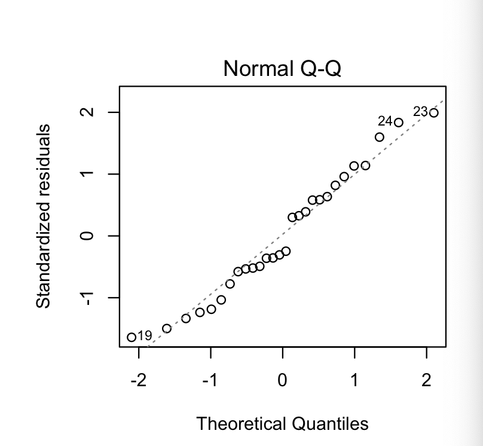
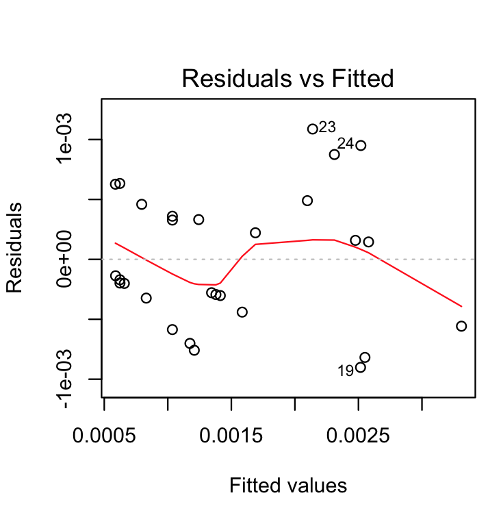
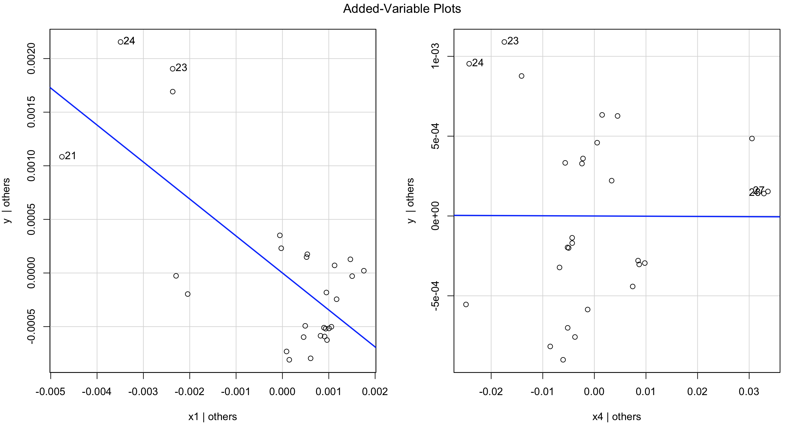

#### Question 3.9

```R
    # Read data from csv
    data <- read_csv("TableB6.csv")

    # Fit data to linear model
    model1 <- lm(y ~ x1 + x4, data = data)

    # Print the model summary
    summary(model1)

    # Output
    # Residuals:
    #     Min         1Q     Median         3Q        Max 
    # -0.0009015 -0.0003526 -0.0001538  0.0003847  0.0010874 

    # Coefficients:
    #             Estimate Std. Error t value Pr(>|t|)    
    # (Intercept)  0.0048333  0.0008142   5.936 3.39e-06 ***
    # x1          -0.3449837  0.0673963  -5.119 2.74e-05 ***
    # x4          -0.0001430  0.0078151  -0.018    0.986    
    # ---
    # Signif. codes:  0 ‘***’ 0.001 ‘**’ 0.01 ‘*’ 0.05 ‘.’ 0.1 ‘ ’ 1

    # Residual standard error: 0.0005804 on 25 degrees of freedom
    # Multiple R-squared:  0.6636,    Adjusted R-squared:  0.6367 
    # F-statistic: 24.66 on 2 and 25 DF,  p-value: 1.218e-06

    par(mfrow = c(2, 2))
    plot(model1)

```

**a.** Construct a normal probability plot of the residuals. Does there seem to be any problem with the normality assumption? 

<p align="left">
  
</p>

There does not seem to be a problem with normality as the plots are generally in a straight line.

**b.** Construct and interpret a plot of the residuals versus the predicted response. 


<p align="left">
  
</p>

The plots are relatively shapeless and there is no linear pattern. The residuals are almost equally distributed around the 0 line without particularly large outliers.


**c.**  Construct the partial regression plots for this model. Does it seem that some variables currently in the model are not necessary? 

<p align="left">
  
</p>

x1 shows a linear pattern but x4 does not. Hence concentration of COCl2 has strongest influence on predicting the concentration of NbOCl3 when compared to mole fraction.