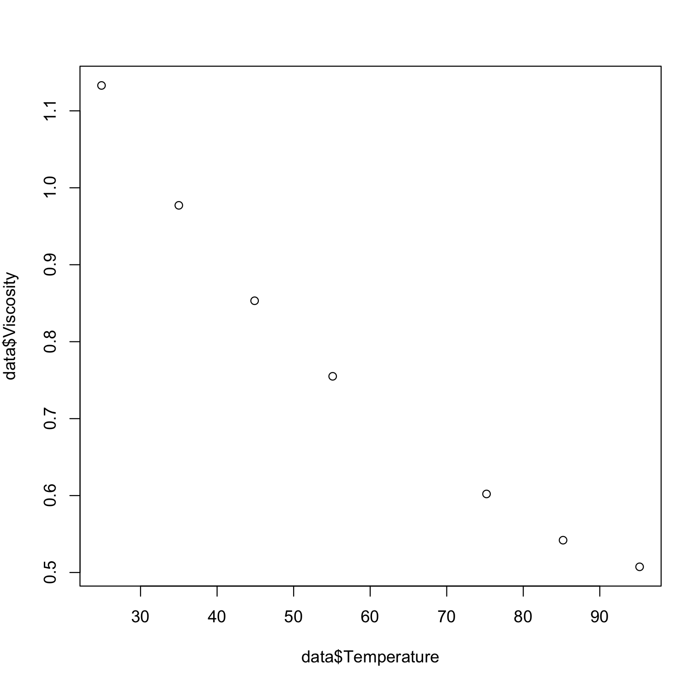
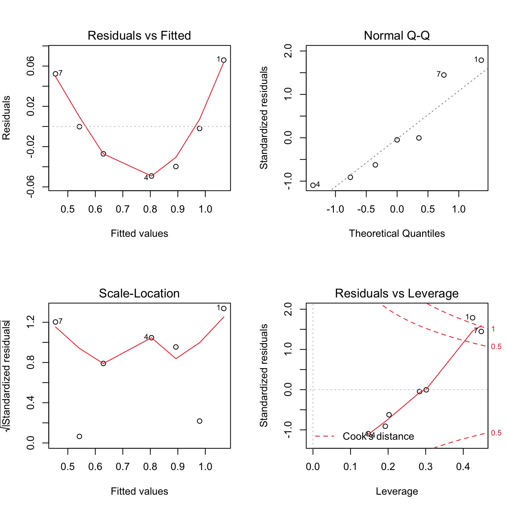
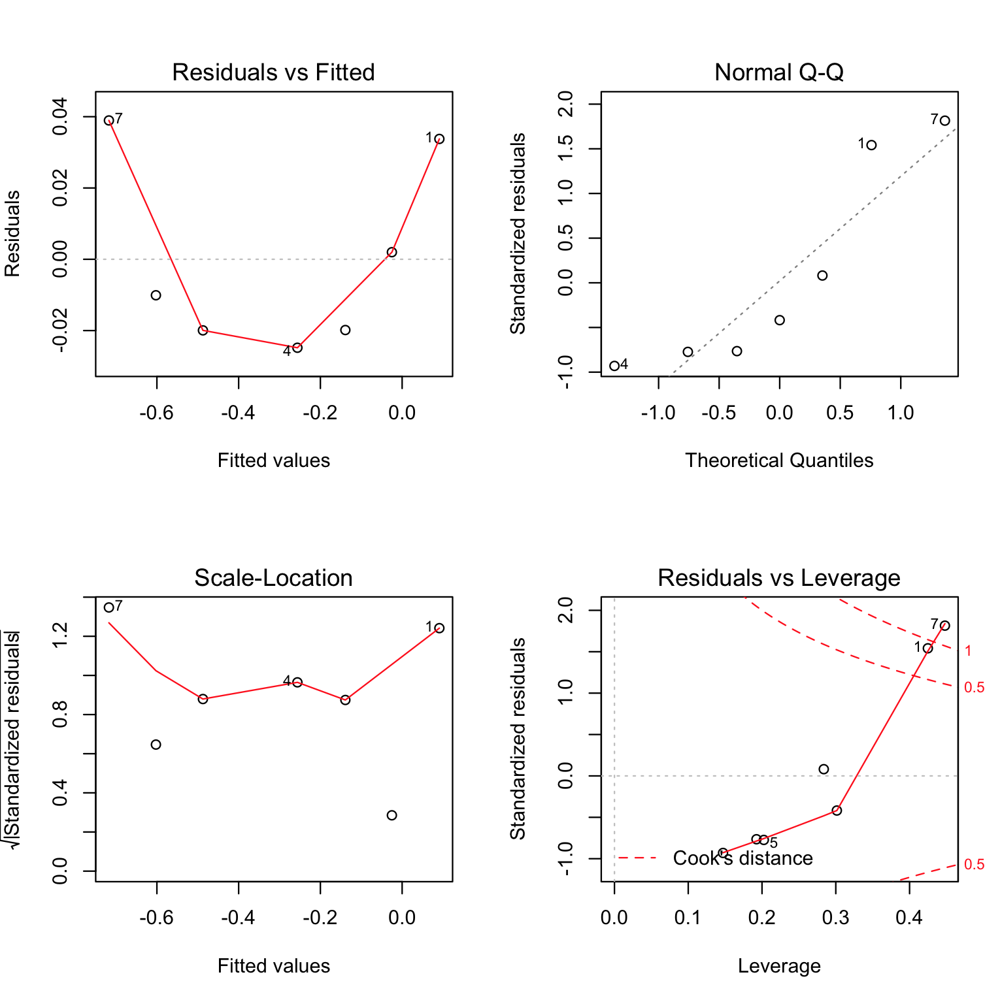

#### Question 5.1

**TableTempVisc.csv**

| Temperature | Viscosity |
| ----------- | --------- |
| 24.9        | 1.133     |
| 35.0        | 0.9772    |
| 44.9        | 0.8532    |
| 55.1        | 0.7550    |
| 75.2        | 0.6021    |
| 85.2        | 0.5420    |
| 95.2        | 0.5074    |

```R

# Read data from csv
data <- read_csv("TableTempVisc.csv")

plot(data$Temperature,data$Viscosity)

```

**a.** Plot a scatter diagram. Does it seem likely that a straight-line model will be adequate? 

<p align="left">
  
</p>

The plots seem to have a non-linear pattern. Hence a straight-line model will not be adequate.

**b.**  Fit the straight-line model. Compute the summary statistics and the residual plots. What are your conclusions regarding model adequacy? 


```R

# Read data from csv
data <- read_csv("TableTempVisc.csv")

# Fit data to linear model
model1 <- lm(Viscosity ~ Temperature, data = data)

# Print the model summary
summary(model1)

# Output
# Residuals:
#          1          2          3          4          5          6          7 
#  0.0659282 -0.0019532 -0.0397754 -0.0491862 -0.0271193 -0.0001711  0.0522771 

# Coefficients:
#               Estimate Std. Error t value Pr(>|t|)    
# (Intercept)  1.2838219  0.0481199   26.68 1.38e-06 ***
# Temperature -0.0087048  0.0007492  -11.62 8.29e-05 ***
# ---
# Signif. codes:  0 ‘***’ 0.001 ‘**’ 0.01 ‘*’ 0.05 ‘.’ 0.1 ‘ ’ 1

# Residual standard error: 0.04862 on 5 degrees of freedom
# Multiple R-squared:  0.9643,    Adjusted R-squared:  0.9571 
# F-statistic:   135 on 1 and 5 DF,  p-value: 8.293e-05

par(mfrow = c(2, 2))
plot(model1)

```

<p align="left">
  
</p>

 - **Residuals vs Fitted:**
The plot of residuals versus fitted values indicates a non-linear relationship in the data.

 - **Normal Q-Q:**
This model does not have its residuals normally distributed.

- **Scale-Location (or Spread-Location):** 
Since the variance of the residuals is not equally spread points the model dont have homoscedasticity and has a heteroscedasticity problem.

- **Conclusion:**
While R2 = 96.4%, the residual plot shows a nonlinear pattern and normality is violated.

**c.**  Basic principles of physical chemistry suggest that the viscosity is an exponential function of the temperature. Repeat part b using the appropriate transformation based on this information.

```R

# Read data from csv
data <- read_csv("TableTempVisc.csv")

# Fit data to linear model
model2 <- lm(log(Viscosity) ~ (Temperature), data = data)

# Print the model summary
summary(model2)

# Output
# Residuals:
#        1        2        3        4        5        6        7 
#  0.03376  0.00199 -0.01985 -0.02482 -0.01994 -0.01009  0.03895 

# Coefficients:
#              Estimate Std. Error t value Pr(>|t|)    
# (Intercept)  0.377476   0.028583   13.21 4.45e-05 ***
# Temperature -0.011501   0.000445  -25.84 1.62e-06 ***
# ---
# Signif. codes:  0 ‘***’ 0.001 ‘**’ 0.01 ‘*’ 0.05 ‘.’ 0.1 ‘ ’ 1

# Residual standard error: 0.02888 on 5 degrees of freedom
# Multiple R-squared:  0.9926,    Adjusted R-squared:  0.9911 
# F-statistic: 667.8 on 1 and 5 DF,  p-value: 1.621e-06

par(mfrow = c(2, 2))
plot(model2)

```

<p align="left">
  
</p>

 - **Residuals vs Fitted:**
The plot of residuals versus fitted values indicates a non-linear relationship in the data.

 - **Normal Q-Q:**
This model does not have its residuals normally distributed.

- **Scale-Location (or Spread-Location):** 
Since the variance of the residuals is not equally spread points the model dont have homoscedasticity and has a heteroscedasticity problem.

- **Conclusion:**
While R2 = 99.3% (a slight improvement in model), the residual plot still shows a nonlinear pattern and normality is violated.
