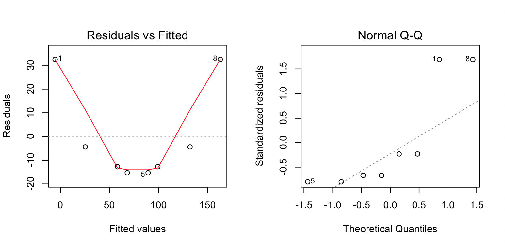
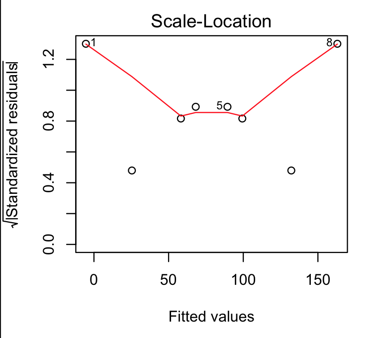

**TableCatapult_v1.csv**

| X1  | X2  | X3  | X4  | y1    | y2    | y3    | mean_y |
| --- | --- | --- | --- | ----- | ----- | ----- | ------ |
| -1  | -1  | -1  | -1  | 28    | 27.1  | 26.2  | 27.10  |
| -1  | -1  | 1   | 1   | 46.3  | 43.5  | 46.5  | 45.43  |
| -1  | 1   | -1  | 1   | 21.9  | 21    | 20.1  | 21.00  |
| -1  | 1   | 1   | -1  | 52.9  | 53.7  | 52    | 52.87  |
| 1   | -1  | -1  | 1   | 75    | 73.1  | 74.3  | 74.13  |
| 1   | -1  | 1   | -1  | 127.7 | 126.9 | 128.7 | 127.77 |
| 1   | 1   | -1  | -1  | 86.2  | 86.5  | 87    | 86.57  |
| 1   | 1   | 1   | 1   | 195   | 195.9 | 195.7 | 195.53 |

```R

# Read data from csv
data <- read_csv("TableCatapult_v1.csv")

# First order regression model fit
model_mean <- lm(mean_y ~ X1 + X2 + X3 + X4, data = data)

# Print the model summary
summary(model_mean)

# Output
# Residuals:
#       1       2       3       4       5       6       7       8 
#  32.515 -12.800  -4.415 -15.300 -15.300  -4.415 -12.800  32.515 

# Coefficients:
#             Estimate Std. Error t value Pr(>|t|)   
# (Intercept)   78.800     11.085   7.108  0.00573 **
# X1            42.200     11.085   3.807  0.03186 * 
# X2            10.193     11.085   0.919  0.42567   
# X3            26.600     11.085   2.400  0.09591 . 
# X4             5.223     11.085   0.471  0.66970   
# ---
# Signif. codes:  0 ‘***’ 0.001 ‘**’ 0.01 ‘*’ 0.05 ‘.’ 0.1 ‘ ’ 1

# Residual standard error: 31.35 on 3 degrees of freedom
# Multiple R-squared:  0.8766,    Adjusted R-squared:  0.7121 
# F-statistic: 5.329 on 4 and 3 DF,  p-value: 0.1003

# diagnostic plots of the linear regression fit
plot(hist(resid(model_mean)))

par(mfrow = c(2, 2))
plot(model_mean)

```


**a.** Fit a first-order regression model to the data and conduct the residual analysis. 

$$
    \hat y = 78.8 + 42.2X1 + 10.2X2 + 26.6X3 + 5.2X4
$$

**Residual Analysis**

<p align="left">
  
</p>

 - **Residuals vs Fitted:**
The plot of residuals versus fitted values indicates a non-linear relationship in the data.

 - **Normal Q-Q:**
This model does not have its residuals normally distributed.

<p align="left">
  
</p>

- **Scale-Location (or Spread-Location):** 
Since the variance of the residuals is not equally spread points the model dont have homoscedasticity and has a heteroscedasticity problem.

**b.** Use the sample variances as the basis for weighted least-squares estimation of the original data (not the sample means). 

**TableCatapult_v2.csv**
| X1  | X2  | X3  | X4  | y1    | y2    | y3    | mean_y | var_y | weights |
| --- | --- | --- | --- | ----- | ----- | ----- | ------ | ----- | ------- |
| -1  | -1  | -1  | -1  | 28    | 27.1  | 26.2  | 27.10  | 0.81  | 1.23    |
| -1  | -1  | 1   | 1   | 46.3  | 43.5  | 46.5  | 45.43  | 2.81  | 0.36    |
| -1  | 1   | -1  | 1   | 21.9  | 21    | 20.1  | 21.00  | 0.81  | 1.23    |
| -1  | 1   | 1   | -1  | 52.9  | 53.7  | 52    | 52.87  | 0.72  | 1.38    |
| 1   | -1  | -1  | 1   | 75    | 73.1  | 74.3  | 74.13  | 0.92  | 1.08    |
| 1   | -1  | 1   | -1  | 127.7 | 126.9 | 128.7 | 127.77 | 0.81  | 1.23    |
| 1   | 1   | -1  | -1  | 86.2  | 86.5  | 87    | 86.57  | 0.16  | 6.12    |
| 1   | 1   | 1   | 1   | 195   | 195.9 | 195.7 | 195.53 | 0.22  | 4.48    |

```R

# Read data from csv
data <- read_csv("TableCatapult_v2.csv")

# Fit data to linear model
model_sample_var <- lm(mean_y ~ X1 + X2 + X3 + X4, data = data, weights = data$weights)

# Print the model summary
summary(model_sample_var)

# Output
# Weighted Residuals:
#       1       2       3       4       5       6       7       8 
#  46.222 -21.256 -11.501 -21.924 -24.783 -11.501  -5.155  24.220 

# Coefficients:
#             Estimate Std. Error t value Pr(>|t|)   
# (Intercept)   84.755     12.267   6.909  0.00621 **
# X1            42.460     11.196   3.793  0.03217 * 
# X2             9.156     11.491   0.797  0.48378   
# X3            33.899     10.437   3.248  0.04756 * 
# X4            13.818     10.507   1.315  0.27995   
# ---
# Signif. codes:  0 ‘***’ 0.001 ‘**’ 0.01 ‘*’ 0.05 ‘.’ 0.1 ‘ ’ 1

# Residual standard error: 38.99 on 3 degrees of freedom
# Multiple R-squared:  0.926,     Adjusted R-squared:  0.8273 
# F-statistic: 9.385 on 4 and 3 DF,  p-value: 0.04809

```

Applying weighted least squares to the data using the weights in Table gives the below fitted model

$$
    \hat y = 84.8+ 42.3X1 + 9.2X2 + 33.9X3 + 13.8X4
$$

**c.** Fit an appropriate model to the sample variances (note: you will require an appropriate transformation!). Use this model to develop the appropriate weights and repeat part b.


```R

# Read data from csv
data <- read_csv("TableCatapult_v2.csv")

# Fit data to linear model
model_est_var <- lm(log(var_y) ~ X1 + X2 + X3 + X4, data = data)

# Print the model summary
summary(model_est_var)

# Output
# Residuals:
#       1       2       3       4       5       6       7       8 
# -0.4427  0.0200  0.2090  0.2138  0.2138  0.2090  0.0200 -0.4427 

# Coefficients:
#             Estimate Std. Error t value Pr(>|t|)  
# (Intercept)  -0.4197     0.1543  -2.720   0.0726 .
# X1           -0.4905     0.1543  -3.179   0.0502 .
# X2           -0.5518     0.1543  -3.576   0.0374 *
# X3            0.1647     0.1543   1.067   0.3642  
# X4            0.2259     0.1543   1.464   0.2394  
# ---
# Signif. codes:  0 ‘***’ 0.001 ‘**’ 0.01 ‘*’ 0.05 ‘.’ 0.1 ‘ ’ 1

# Residual standard error: 0.4365 on 3 degrees of freedom
# Multiple R-squared:  0.8972,    Adjusted R-squared:   0.76 
# F-statistic: 6.543 on 4 and 3 DF,  p-value: 0.07737

```
A least­squares fit to log transformed sample variances

$$
    \hat s^2_y = -0.42 - 0.49X1 - 0.55X2 + 0.16X3 + 0.23X4
$$

Substituting each x_i values into this equation will give an estimate of the variance of the corresponding observation y_i. The inverse of these fitted values will be reasonable estimates of the weights w_i.

**TableCatapult_v3.csv**

| X1  | X2  | X3  | X4  | y1    | y2    | y3    | mean_y | var_y | hat_var_y | weights |
| --- | --- | --- | --- | ----- | ----- | ----- | ------ | ----- | --------- | ------- |
| -1  | -1  | -1  | -1  | 28    | 27.1  | 26.2  | 27.10  | 0.81  | 1.20      | 0.83    |
| -1  | -1  | 1   | 1   | 46.3  | 43.5  | 46.5  | 45.43  | 2.81  | 2.23      | 0.45    |
| -1  | 1   | -1  | 1   | 21.9  | 21    | 20.1  | 21.00  | 0.81  | 0.91      | 1.10    |
| -1  | 1   | 1   | -1  | 52.9  | 53.7  | 52    | 52.87  | 0.72  | 0.81      | 1.24    |
| 1   | -1  | -1  | 1   | 75    | 73.1  | 74.3  | 74.13  | 0.92  | 1.01      | 0.99    |
| 1   | -1  | 1   | -1  | 127.7 | 126.9 | 128.7 | 127.77 | 0.81  | 0.91      | 1.10    |
| 1   | 1   | -1  | -1  | 86.2  | 86.5  | 87    | 86.57  | 0.16  | -0.42     | -2.40   |
| 1   | 1   | 1   | 1   | 195   | 195.9 | 195.7 | 195.53 | 0.22  | 0.61      | 1.63    |

Applying weighted least squares to the data using the weights in above Table gives the fitted model

```R

# Read data from csv
data <- read_csv("TableCatapult_v3.csv")

# Fit data to linear model
model_weights <- lm(mean_y ~ X1 + X2 + X3 + X4, data = data, weights = data$weights)

# Print the model summary
summary(model_weights)

# Output
# Weighted Residuals:
#       1       2       3       4       5       6       7       8 
#  37.959 -15.675  -5.757 -16.190 -18.119  -5.757  -6.788  27.087 

# Coefficients:
#             Estimate Std. Error t value Pr(>|t|)   
# (Intercept)   79.875     11.324   7.053  0.00586 **
# X1            42.842     10.700   4.004  0.02793 * 
# X2             9.916     10.868   0.912  0.42881   
# X3            31.070     10.417   2.983  0.05847 . 
# X4            10.611     10.479   1.013  0.38583   
# ---
# Signif. codes:  0 ‘***’ 0.001 ‘**’ 0.01 ‘*’ 0.05 ‘.’ 0.1 ‘ ’ 1

# Residual standard error: 32.26 on 3 degrees of freedom
# Multiple R-squared:  0.8997,    Adjusted R-squared:  0.7659 
# F-statistic: 6.724 on 4 and 3 DF,  p-value: 0.07469

```
Applying weighted least squares to the data using the weights in Table gives the below fitted model

$$
    \hat y = 79.9+ 42.9X1 + 9.9X2 + 31.1X3 + 10.6X4
$$