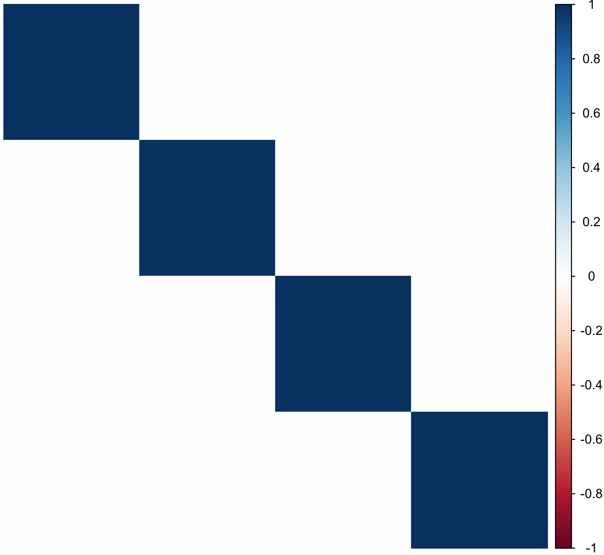
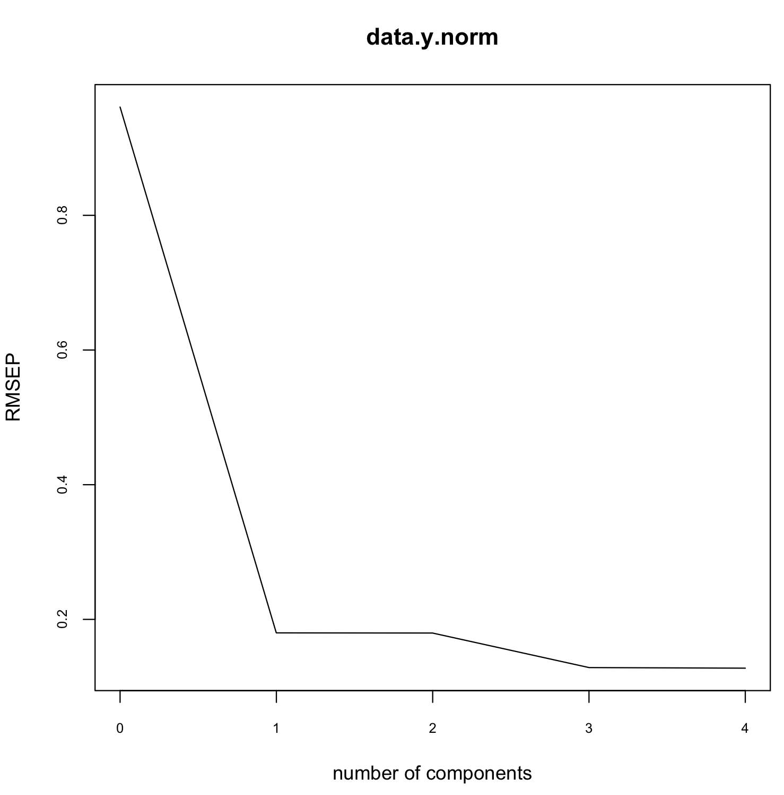
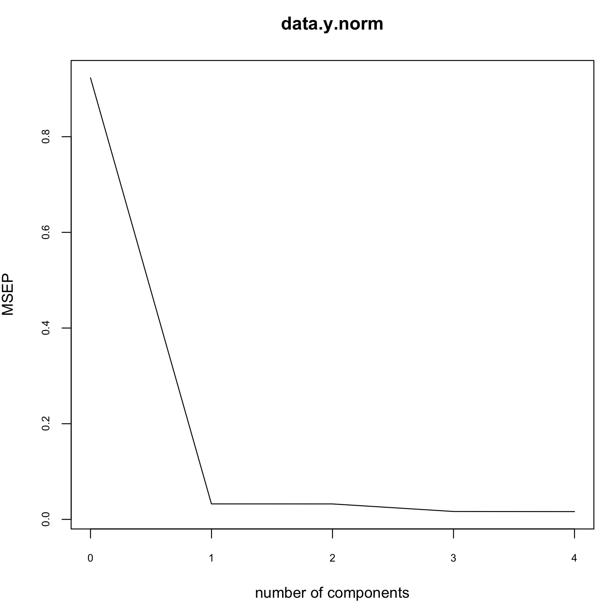
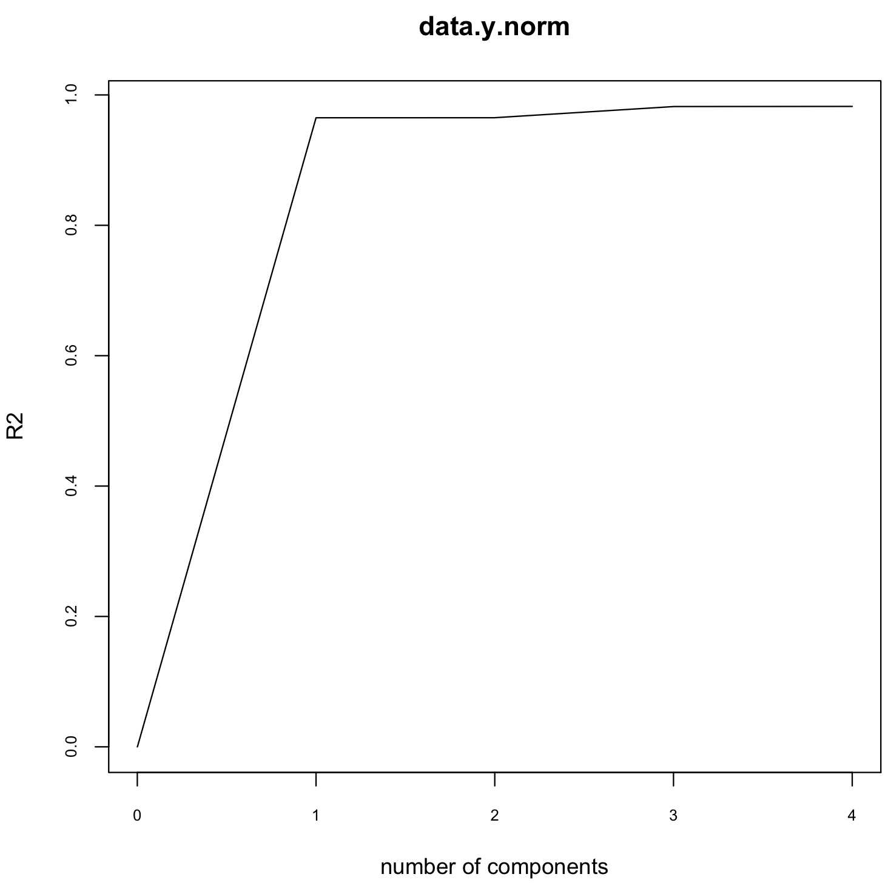

#### Question 5.13

**TableB21.csv**

| Y     | X1  | X2  | X3  | X4  |
| ----- | --- | --- | --- | --- |
| 78.5  | 7   | 26  | 6   | 60  |
| 74.3  | 1   | 29  | 15  | 52  |
| 104.3 | 11  | 56  | 8   | 20  |
| 87.6  | 11  | 31  | 8   | 47  |
| 95.9  | 7   | 52  | 6   | 33  |
| 109.2 | 11  | 55  | 9   | 22  |
| 102.7 | 3   | 71  | 17  | 6   |
| 72.5  | 1   | 31  | 22  | 44  |
| 93.1  | 2   | 54  | 18  | 22  |
| 115.9 | 21  | 47  | 4   | 26  |
| 83.8  | 1   | 40  | 23  | 34  |
| 113.3 | 11  | 66  | 9   | 12  |
| 109.4 | 10  | 68  | 8   | 12  |

```R
# Read data from csv
data <- read_csv("TableB21.csv")

# Linear model without PCA
lmodel.none <- lm(Y ~ ., data = data)
summary(lmodel.none)

# Output
# 
# Residuals:
#     Min      1Q  Median      3Q     Max 
# -3.1750 -1.6709  0.2508  1.3783  3.9254 

# Coefficients:
#             Estimate Std. Error t value Pr(>|t|)  
# (Intercept)  62.4054    70.0710   0.891   0.3991  
# X1            1.5511     0.7448   2.083   0.0708 .
# X2            0.5102     0.7238   0.705   0.5009  
# X3            0.1019     0.7547   0.135   0.8959  
# X4           -0.1441     0.7091  -0.203   0.8441  
# ---
# Signif. codes:  0 ‘***’ 0.001 ‘**’ 0.01 ‘*’ 0.05 ‘.’ 0.1 ‘ ’ 1

# Residual standard error: 2.446 on 8 degrees of freedom
# Multiple R-squared:  0.9824,    Adjusted R-squared:  0.9736 
# F-statistic: 111.5 on 4 and 8 DF,  p-value: 4.756e-07

# Extracting the dependent variable y to data.y and removing it from the original dataframe.
data.y <- data$Y
data$Y <- NULL

# Understand variable correlation
res <- cor(data, method="pearson")
corrplot::corrplot(res, method= "color", order = "hclust", tl.pos = 'n')

# Do data normalization
data.norm <- scale(data)
data.y.norm <- scale(data.y)

# Get summary of principle components
data.pca1 <- prcomp(data.norm, center=TRUE, scale.=TRUE)
summary(data.pca1)

# Output:
# 
# Importance of components:
#                           PC1    PC2     PC3     PC4
# Standard deviation     1.4952 1.2554 0.43198 0.04030
# Proportion of Variance 0.5589 0.3940 0.04665 0.00041
# Cumulative Proportion  0.5589 0.9529 0.99959 1.00000

# Look at the eigen values
data.pca1$sdev

# Output:
# 
# [1] 1.49522708 1.25541470 0.43197934 0.04029573

# Understand principle components correlation
res1 <- cor(data.pca1$x, method="pearson")
corrplot::corrplot(res1, method= "color", order = "hclust", tl.pos = 'n')

#  Combine both principle components and y
pcs <- as.data.frame(data.pca1$x)
pcr.data <- cbind(data.y.norm, pcs)

# Perform principle component regression
lmodel <- lm(data.y.norm ~ PC1 + PC2, data = pcr.data)
summary(lmodel)

# Output:

# Residuals:
#      Min       1Q   Median       3Q      Max 
# -0.22139 -0.14545 -0.06309  0.07311  0.29415 

# Coefficients:
#              Estimate Std. Error t value Pr(>|t|)    
# (Intercept) 3.247e-16  5.682e-02   0.000    1.000    
# PC1         6.570e-01  3.955e-02  16.610 1.31e-08 ***
# PC2         8.309e-03  4.711e-02   0.176    0.864    
# ---
# Signif. codes:  0 ‘***’ 0.001 ‘**’ 0.01 ‘*’ 0.05 ‘.’ 0.1 ‘ ’ 1

# Residual standard error: 0.2049 on 10 degrees of freedom
# Multiple R-squared:  0.965,     Adjusted R-squared:  0.958 
# F-statistic:   138 on 2 and 10 DF,  p-value: 5.233e-08

# Perform principle component regression using significant PC
lmodel <- lm(data.y.norm ~ PC1, data = pcr.data)
summary(lmodel)

# Output:

# Residuals:
#      Min       1Q   Median       3Q      Max 
# -0.21775 -0.15220 -0.05734  0.07651  0.30491 

# Coefficients:
#              Estimate Std. Error t value Pr(>|t|)    
# (Intercept) 3.273e-16  5.426e-02    0.00        1    
# PC1         6.570e-01  3.777e-02   17.39 2.38e-09 ***
# ---
# Signif. codes:  0 ‘***’ 0.001 ‘**’ 0.01 ‘*’ 0.05 ‘.’ 0.1 ‘ ’ 1

# Residual standard error: 0.1956 on 11 degrees of freedom
# Multiple R-squared:  0.9649,    Adjusted R-squared:  0.9617 
# F-statistic: 302.5 on 1 and 11 DF,  p-value: 2.377e-09


fit <- pcr(data.y.norm ~., data = pcr.data)

validationplot(fit, val.type="RMSEP", cex.axis=0.7)
axis(side = 1, at = c(8), cex.axis=0.7)
abline(v = 8, col = "blue", lty = 3)

validationplot(fit, val.type="MSEP", cex.axis=0.7)
axis(side = 1, at = c(8), cex.axis=0.7)
abline(v = 8, col = "blue", lty = 3)

validationplot(fit, val.type="R2", cex.axis=0.7)
axis(side = 1, at = c(8), cex.axis=0.7)
abline(v = 8, col = "blue", lty = 3)

```

Understanding Variable correlation:

From the correlation plot it is observed there is signigicant correlation among some of the variables.
After doing PCA in our dataset, since the principal components are orthogonal, the correlation is removed. Thus the correlation plot is perfectly white, apart from autocorrelation.

<p align="left">
    <figure>
        
        <figcaption>Correlation before PCA</figcaption>
    </figure>
    <figure>
        
        <figcaption>Correlation after PCA</figcaption>
    </figure>
</p>

**Choosing the appropriate number of PCs**

- Method 1:

The eigen values are 1.49522708, 1.25541470, 0.43197934, 0.04029573

After removing the components with eigen values 0 we are left with PC1 and PC2. And the PCR is performed with PC1 and PC2.
From the summary of fitted PCR, the t-value of PC2 is 0.1 and it has very less significance to the model. Hence I do PCR only with PC1.

- Method 2:

Another method that can be used is to assess the best number of principal components is based on accuracy measures - RMSEP, MSEP and R2.

From plots below it is visible that for all measures, the point where the change is most dramatic is 1. This is the desired number of principal components.

<p align="left">
  
  
  
</p>

**Result:**

Estimated model parameters for the Hald cement data using principal-component regression.

$$\hat \gamma_0 = 3.273e^{-16}$$
$$\hat \gamma_1=6.570e^{-1}$$

**a.** What is the loss in R2 for this model compared to least squares? 

The Principal components regression yields R2 = 96.49% while least squares yields R2 = 98.2%. The loss is minimal at around 2%.

**b.** How much shrinkage in the coefficient vector has resulted?

The coefficient vector is reduced to one term.
