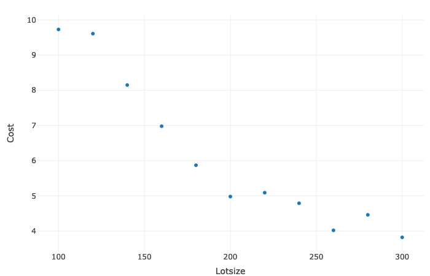
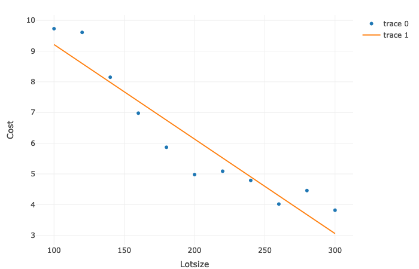
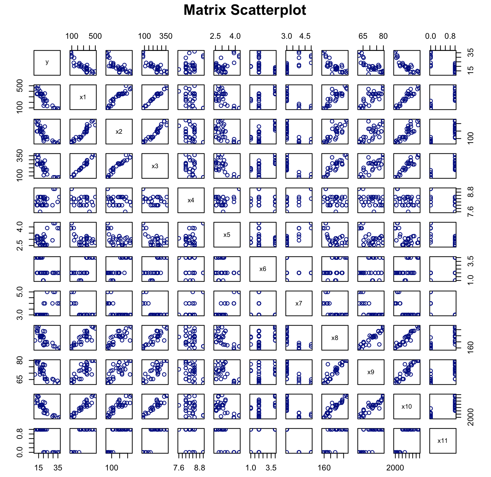
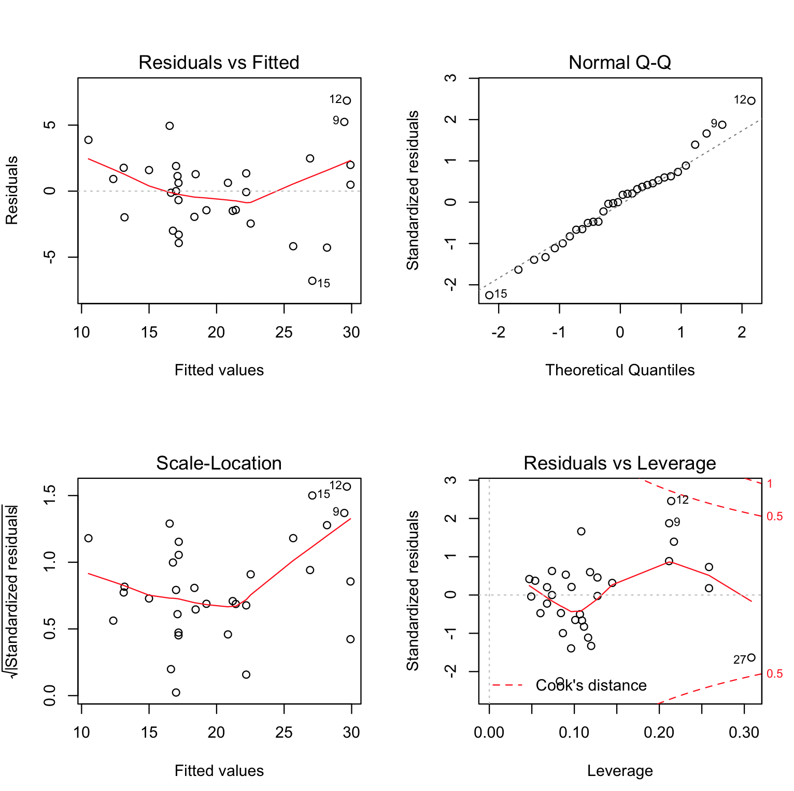
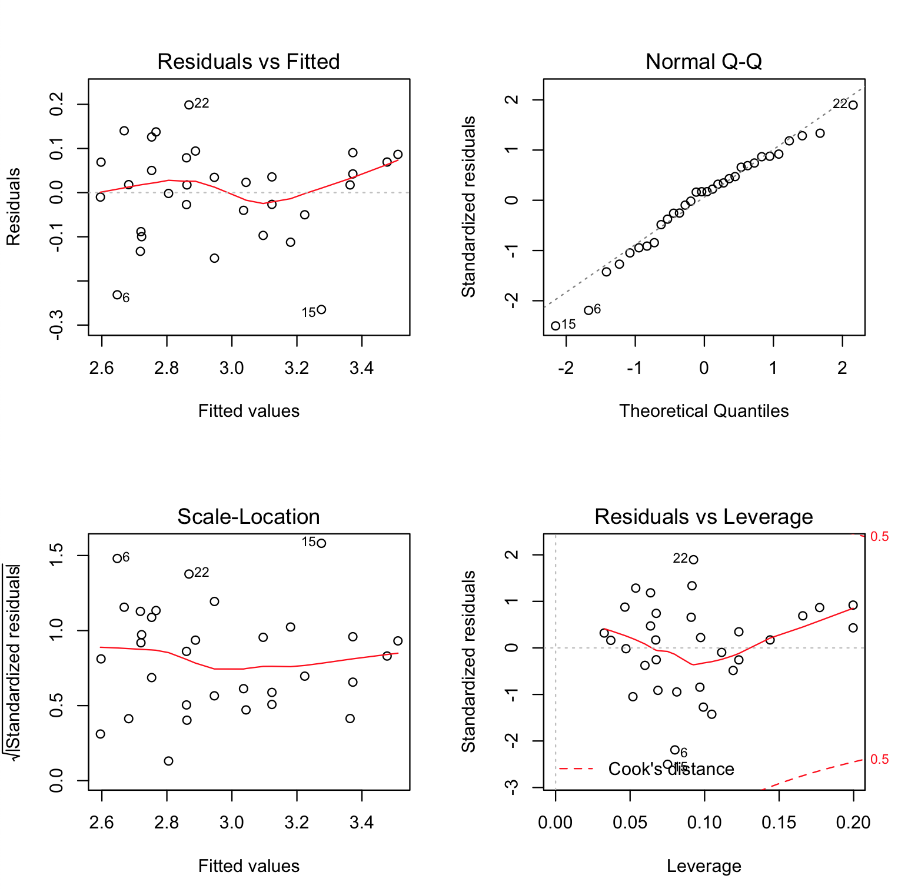

### Yokesh Thirumoorthi (STAT 564 FINALS)

#### Question 1

```R
    # Import the libraries
    library(plotly)
    library(segmented)

    # Create the dataset:
    Lotsize <- c(100,120,140,160,180,200,220,240,260,280,300)
    Cost <- c(9.73,9.61,8.15,6.98,5.87,4.98,5.09,4.79,4.02,4.46,3.82)
    data <- data.frame(Lotsize,Cost)

    # Visalize the dataset:
    plot_ly(data,x=~Lotsize, y=~Cost, type="scatter")

    # Fit a linear regression
    fit <- lm(Cost ~ Lotsize, data=data)
    summary(fit)

    # Output
    # Residuals:
    #     Min      1Q  Median      3Q     Max 
    # -1.1564 -0.4091 -0.1154  0.6386  1.0118 

    # Coefficients:
    #             Estimate Std. Error t value Pr(>|t|)    
    # (Intercept) 12.290909   0.749146  16.407 5.17e-08 ***
    # Lotsize     -0.030773   0.003571  -8.616 1.22e-05 ***
    # ---
    # Signif. codes:  0 ‘***’ 0.001 ‘**’ 0.01 ‘*’ 0.05 ‘.’ 0.1 ‘ ’ 1

    # Residual standard error: 0.7491 on 9 degrees of freedom
    # Multiple R-squared:  0.8919,    Adjusted R-squared:  0.8799 
    # F-statistic: 74.24 on 1 and 9 DF,  p-value: 1.218e-05


    # Visalize the linear regression fit:
    plot_ly(data,x=~Lotsize, 
                y=~Cost, 
                type="scatter") %>% add_lines(x = ~Lotsize, y = fitted(fit))

    # Xbar here is called the Knot value.
    # Using Xbar = 200, manipulate the data
    data$Xbar <- ifelse(data$Lotsize>200,1,0)
    data$diff <- data$Lotsize - 200
    data$X <- data$diff*data$Xbar

    data
    
    # Output:
    #   Lotsize Cost    Xbar diff X
    # 1      100 9.73    0 -100   0
    # 2      120 9.61    0  -80   0
    # 3      140 8.15    0  -60   0
    # 4      160 6.98    0  -40   0
    # 5      180 5.87    0  -20   0
    # 6      200 4.98    0    0   0
    # 7      220 5.09    1   20  20
    # 8      240 4.79    1   40  40
    # 9      260 4.02    1   60  60
    # 10     280 4.46    1   80  80
    # 11     300 3.82    1  100 100

    # Fit the linear spline regression
    # The X in the equation below is (x-xbar)*Xk
    reg <- lm(Cost ~ Lotsize + X, data = data)

    plot_ly(data,x=~Lotsize,
            y=~Cost,
            type="scatter") %>% add_lines(x =  ~Lotsize, y = fitted(reg))

    summary(reg)
    


    ### Yokesh Thirumoorthi (STAT 564 FINALS)

    # Output:

    # Residuals:
    #     Min       1Q   Median       3Q      Max 
    # -0.37596 -0.16641 -0.09677  0.20363  0.51734 

    # Coefficients:
    #             Estimate Std. Error t value Pr(>|t|)    
    # (Intercept) 15.116481   0.535383  28.235 2.67e-09 ***
    # Lotsize     -0.050199   0.003332 -15.065 3.73e-07 ***
    # X            0.038852   0.005946   6.534 0.000181 ***
    # ---
    # Signif. codes:  0 ‘***’ 0.001 ‘**’ 0.01 ‘*’ 0.05 ‘.’ 0.1 ‘ ’ 1

    # Residual standard error: 0.3157 on 8 degrees of freedom
    # Multiple R-squared:  0.9829,    Adjusted R-squared:  0.9787 
    # F-statistic: 230.4 on 2 and 8 DF,  p-value: 8.474e-08

    
    # Above results can also be obtained using Segmented package in R:
    fit_seg <- segmented(fit, seg.Z = ~Quantity, psi = list(Quantity=200))

    plot_ly(data,x=~Quantity,
            y=~Sales,
            type="scatter") %>% add_lines(x =  ~Quantity, y = fitted(fit_seg))

    summary(fit_seg)
    #Output:

    # Estimated Break-Point(s):
    #               Est. St.Err
    # psi1.Quantity 195.766 10.524

    # Meaningful coefficients of the linear terms:
    #             Estimate Std. Error t value Pr(>|t|)    
    # (Intercept) 15.313000   0.753708  20.317 1.75e-07 ***
    # Lotsize     -0.051750   0.005277  -9.807 2.43e-05 ***
    # U1.Quantity  0.039664   0.006615   5.996       NA    
    # ---
    # Signif. codes:  0 ‘***’ 0.001 ‘**’ 0.01 ‘*’ 0.05 ‘.’ 0.1 ‘ ’ 1

    # Residual standard error: 0.3337 on 7 degrees of freedom
    # Multiple R-Squared: 0.9833,  Adjusted R-squared: 0.9762 

    # Convergence attained in 2 iter. (rel. change 1.6406e-15)
```

**Visualize the Dataset**
<p align="left">
  
</p>

<br><br><br><br>
<br><br><br><br>
### Yokesh Thirumoorthi (STAT 564 FINALS)

**Visalize the linear regression fit**
<p align="left">
  
</p>

**Visalize the spline fit**
<p align="left">
  
</p>

**Comparing Results:**
  
The model using linear spline
$$\hat y = 15.31 − .05x + 0.039(x-200)^1$$

The test 
$$H_0:\beta_{1}=0$$
which gives a t-value = 6.5 and p-value = 0.000

The R2 obtained using simple linear regression fit is  
$$R^2 = 89.19\%$$

The R2 obtained using linear spline fit is  
$$R^2 = 98.3\%$$

Since the R2 obtained using linear spline fit is better, the data support the use
of linear spline model

<br><br><br><br><br>
<br><br><br><br><br>
### Yokesh Thirumoorthi (STAT 564 FINALS)

#### Question 2

```R
library(readr) 
library(car)
# Read data from csv
data <- read_csv("TableB3.csv")

data

# a scatterplot matrix which include all the variables in the data set.
# Plot matrix of all variables.
plot(data, col="navy", main="Matrix Scatterplot")
```

**Understanding Data:**

Inorder to get a high level overview of the data, i used the matrix scatter plot as shown below.

<p align="left">
  
</p>

The above matrix plot helps to see the relationship between two columns and pattern in the datasets. For example, x1, x2, x3, x8, x9 and x10 seem to have similiar relationships. From the plot, y seems to have the same pattern with x1, x2, x3, x8, x9 and x10. Also, y seems to follow similar pattern with x6, x7 and x11.

In order to find the best model for predicting the y using different predictors in data, I look upon residuals error, p-value for the performance of the model.

**Fitting Models**

```R
# Fit data to linear model
fit1 <- lm(y ~ ., data = data)

# Print the model summary
summary(fit1)
# Output
# Residuals:
#     Min      1Q  Median      3Q     Max 
# -5.3441 -1.6711 -0.4486  1.4906  5.2508 

# Coefficients:
#              Estimate Std. Error t value Pr(>|t|)  
# (Intercept) 17.339838  30.355375   0.571   0.5749  
# x1          -0.075588   0.056347  -1.341   0.1964  
# x2          -0.069163   0.087791  -0.788   0.4411  
# x3           0.115117   0.088113   1.306   0.2078  
# x4           1.494737   3.101464   0.482   0.6357  
# x5           5.843495   3.148438   1.856   0.0799 .
# x6           0.317583   1.288967   0.246   0.8082  
# x7          -3.205390   3.109185  -1.031   0.3162  
# x8           0.180811   0.130301   1.388   0.1822  
# x9          -0.397945   0.323456  -1.230   0.2344  
# x10         -0.005115   0.005896  -0.868   0.3971  
# x11          0.638483   3.021680   0.211   0.8350  
# ---
# Signif. codes:  0 ‘***’ 0.001 ‘**’ 0.01 ‘*’ 0.05 ‘.’ 0.1 ‘ ’ 1

# Residual standard error: 3.227 on 18 degrees of freedom
#   (2 observations deleted due to missingness)
# Multiple R-squared:  0.8355,    Adjusted R-squared:  0.7349 
# F-statistic:  8.31 on 11 and 18 DF,  p-value: 5.231e-05
```

From the summary of fit1, I have the results of the model. From the model output I found that:

- The parameters - x2, x4, x6, x10 and x11 have t-value close to 0 and high pvalues. It shows that there is no significant relation with y.

- The RSE is 3.227 where p-value is very small.

The matrix scatterplot above shows that there is the high correlation between x1, x2, x3 and x10. When there are two or more variables strongly correlated it is called collinearity. I validate collinearity by using correlation matrix and VIF.

```R
# matrix of correlations between the variables
cor(data, use = "complete.obs")
# Output
#              y         x1         x2         x3          x4         x5
# y    1.0000000 -0.8721701 -0.7968304 -0.8495915  0.42237247  0.6347500
# x1  -0.8721701  1.0000000  0.9408473  0.9891628 -0.34697246 -0.6720903
# x2  -0.7968304  0.9408473  1.0000000  0.9643592 -0.28989951 -0.5509642
# x3  -0.8495915  0.9891628  0.9643592  1.0000000 -0.32599915 -0.6728661
# x4   0.4223725 -0.3469725 -0.2898995 -0.3259992  1.00000000  0.4137808
# x5   0.6347500 -0.6720903 -0.5509642 -0.6728661  0.41378081  1.0000000
# x6  -0.4718055  0.6427984  0.7614190  0.6531263  0.03748643 -0.2195283
# x7   0.7077682 -0.7719151 -0.6259445 -0.7461800  0.55823570  0.8717662
# x8  -0.7528208  0.8623681  0.8027387  0.8641224 -0.30415026 -0.5613315
# x9  -0.7629952  0.7974811  0.7105117  0.7881284 -0.37817358 -0.4534470
# x10 -0.8528801  0.9515520  0.8878810  0.9434871 -0.35845879 -0.5798617
# x11 -0.7212809  0.8244446  0.7086735  0.8012765 -0.44054570 -0.7546650
#              x6         x7         x8         x9        x10        x11
# y   -0.47180548  0.7077682 -0.7528208 -0.7629952 -0.8528801 -0.7212809
# x1   0.64279836 -0.7719151  0.8623681  0.7974811  0.9515520  0.8244446
# x2   0.76141897 -0.6259445  0.8027387  0.7105117  0.8878810  0.7086735
# x3   0.65312630 -0.7461800  0.8641224  0.7881284  0.9434871  0.8012765
# x4   0.03748643  0.5582357 -0.3041503 -0.3781736 -0.3584588 -0.4405457
# x5  -0.21952829  0.8717662 -0.5613315 -0.4534470 -0.5798617 -0.7546650
# x6   1.00000000 -0.2756386  0.4220680  0.3003862  0.5203669  0.3954893
# x7  -0.27563863  1.0000000 -0.6552065 -0.6551300 -0.7058126 -0.8506963
# x8   0.42206800 -0.6552065  1.0000000  0.8831512  0.9554541  0.6824919
# x9   0.30038618 -0.6551300  0.8831512  1.0000000  0.8994711  0.6326677
# x10  0.52036693 -0.7058126  0.9554541  0.8994711  1.0000000  0.7530353
# x11  0.39548928 -0.8506963  0.6824919  0.6326677  0.7530353  1.0000000

car::vif(fit1)
#Output
#         x1         x2         x3         x4         x5         x6         x7 
# 119.487804  42.800811 149.234409   2.060036   7.729187   5.324730  11.761341 
#         x8         x9        x10        x11 
#  20.917632   9.397108  85.744344   5.145052 
```

From the correlation, I can see that there is a strong relation between x1, x2, x3, x8, x9 and x10. The y is also strongly correlated to x1, x2, x3, x8, x9 and x10. This situation is called collinearity. The problem of collinearity in the response is that it is difficult to find the individual effect on response. We should drop use only one of the collinear variables.

Out of x1, x2, x3, x8, x9 and x10, the output of the first model shows that x8 and y have a highly significant relation. I use x1 out of the other collinear variables in the next model.

Also, from fit1, I see x4, x6 and x11 have no significance to model.


<br><br><br><br><br>
<br><br><br><br><br>
### Yokesh Thirumoorthi (STAT 564 FINALS)

```R

# Fit data to linear model
fit2 <- lm(y ~ x1 + x5 + x7, data = data)

# Print the fit2 summary
summary(fit2)

# Output
# Residuals:
#     Min      1Q  Median      3Q     Max 
# -6.7887 -1.9555  0.2436  1.6370  6.8531 

# Coefficients:
#              Estimate Std. Error t value Pr(>|t|)    
# (Intercept) 29.492027   6.655192   4.431 0.000131 ***
# x1          -0.043652   0.007756  -5.628    5e-06 ***
# x5           0.347945   2.057862   0.169 0.866949    
# x7           0.631227   2.006266   0.315 0.755377    
# ---
# Signif. codes:  0 ‘***’ 0.001 ‘**’ 0.01 ‘*’ 0.05 ‘.’ 0.1 ‘ ’ 1

# Residual standard error: 3.149 on 28 degrees of freedom
# Multiple R-squared:  0.7757,    Adjusted R-squared:  0.7517 
# F-statistic: 32.28 on 3 and 28 DF,  p-value: 3.145e-09

car::vif(fit2)
# Output
#       x1       x5       x7 
# 2.585583 3.475845 5.366865 
```

The VIF output show s that I have almost got rid of collinearity problem (execpt for x7 has VIF > 5).
In this model, I find x1 predictor p-value is highly significant. After excluding the collinear variable the F- statistic improved from 8.31 to 32.28 which is a good sign. But there is no improvement on RSE and adjusted R squared value. Let’s plot the residuals:

<p align="left">
  
</p>

 - **Residuals vs Fitted:**
The plot of residuals versus fitted values indicates linearity in the data. A horizontal line, without distinct patterns is an indication for a linear relationship. And for this model it seems to have a pattern fitted with the residuals and fitted values. And it indicates a non-linear relationship in the data.

This plot also shows some of the outliers lying far away from the middle of the graph.

 - **Normal Q-Q:**
This plot is used to examine whether the residuals are normally distributed. It’s good if residuals points follow the straight dashed line. And this model has its residuals normally distributed except for the tail data (the outliers).

### Yokesh Thirumoorthi (STAT 564 FINALS)
 - **Scale-Location (or Spread-Location):** This plot is used to check the homogeneity of variance of the residuals (homoscedasticity). Horizontal line with equally spread points is a good indication of homoscedasticity. This is not the case in this model and hence the model has a heteroscedasticity problem.

 - **Standardized Residuals vs Leverage:** This plot is used to identify influential cases (outliers), that is extreme values that might influence the regression results when included or excluded from the analysis. This plot of standardized residuals versus leverage indicates the presence of a few outliers (example: point 12 and point 27)

I try log transformation on both predictors and the response value and see how the performance of model changes. In the next model, I use the natural log to the y using log() and see the change in performance of the model.

```R
fit3 <- lm(log(y) ~ x1 + x5 + x7, data = data)
summary(fit3)
# Output
# Residuals:
#       Min        1Q    Median        3Q       Max 
# -0.279565 -0.105526  0.009649  0.084624  0.237414 

# Coefficients:
#               Estimate Std. Error t value Pr(>|t|)    
# (Intercept)  3.6371922  0.2889610  12.587 4.79e-13 ***
# x1          -0.0021787  0.0003368  -6.469 5.22e-07 ***
# x5          -0.0786753  0.0893500  -0.881    0.386    
# x7           0.0563762  0.0871098   0.647    0.523    
# ---
# Signif. codes:  0 ‘***’ 0.001 ‘**’ 0.01 ‘*’ 0.05 ‘.’ 0.1 ‘ ’ 1

# Residual standard error: 0.1367 on 28 degrees of freedom
# Multiple R-squared:  0.7997,    Adjusted R-squared:  0.7783 
# F-statistic: 37.27 on 3 and 28 DF,  p-value: 6.522e-10
plot(fit3)
```

The performance of the model is unaffected. The Adjusted R-squared  and F-statistic has not increased. 

```R

fit4 <- lm((y) ~ log(x1) + log(x5) + log(x7), data = data)
summary(fit4)
# Output
# Residuals:
#     Min      1Q  Median      3Q     Max 
# -6.6366 -1.8211  0.2634  1.6410  4.4030 

# Coefficients:
#             Estimate Std. Error t value Pr(>|t|)    
# (Intercept)  109.360     14.965   7.308 5.89e-08 ***
# log(x1)      -13.898      1.690  -8.224 5.97e-09 ***
# log(x5)       -5.495      4.738  -1.160    0.256    
# log(x7)       -5.062      6.160  -0.822    0.418    
# ---
# Signif. codes:  0 ‘***’ 0.001 ‘**’ 0.01 ‘*’ 0.05 ‘.’ 0.1 ‘ ’ 1

# Residual standard error: 2.411 on 28 degrees of freedom
# Multiple R-squared:  0.8685,    Adjusted R-squared:  0.8544 
# F-statistic: 61.62 on 3 and 28 DF,  p-value: 1.885e-12
plot(fit4, which =1)
```

Here the performance of the model has increased. The Adjusted R-squared raised to 0.8544 and F-statistic is increased to 61.62. 

Now, build regression model from a set of candidate predictor variables by entering and removing predictors based on p values, in a stepwise manner until there is no variable left to enter or remove any more.

```R
ols_step_both_p(fit4)
# Output
# Stepwise Selection Method   
# ---------------------------

# Candidate Terms: 

# 1. log(x1) 
# 2. log(x5) 

# We are selecting variables based on p value...

# Variables Entered/Removed: 

# ✔ log(x1) 
# ✔ log(x5) 


# Final Model Output 
# ------------------

#                         Model Summary                          
# --------------------------------------------------------------
# R                       0.930       RMSE                2.398 
# R-Squared               0.865       Coef. Var          11.856 
# Adj. R-Squared          0.856       MSE                 5.749 
# Pred R-Squared          0.834       MAE                 1.802 
# --------------------------------------------------------------
#  RMSE: Root Mean Square Error 
#  MSE: Mean Square Error 
#  MAE: Mean Absolute Error 

#                                ANOVA                                 
# --------------------------------------------------------------------
#                 Sum of                                              
#                Squares        DF    Mean Square      F         Sig. 
# --------------------------------------------------------------------
# Regression    1070.829         2        535.415    93.135    0.0000 
# Residual       166.715        29          5.749                     
# Total         1237.544        31                                    
# --------------------------------------------------------------------

#                                     Parameter Estimates                                      
# --------------------------------------------------------------------------------------------
#       model       Beta    Std. Error    Std. Beta       t        Sig       lower      upper 
# --------------------------------------------------------------------------------------------
# (Intercept)    100.293        10.052                   9.977    0.000     79.734    120.851 
#     log(x1)    -12.910         1.181       -1.056    -10.935    0.000    -15.325    -10.496 
#     log(x5)     -7.707         3.877       -0.192     -1.988    0.056    -15.636      0.223 
# --------------------------------------------------------------------------------------------

#                              Stepwise Selection Summary                              
# ------------------------------------------------------------------------------------
#                      Added/                   Adj.                                      
# Step    Variable    Removed     R-Square    R-Square     C(p)       AIC        RMSE     
# ------------------------------------------------------------------------------------
#    1    log(x1)     addition       0.847       0.842    4.9510    153.7173    2.5128    
#    2    log(x5)     addition       0.865       0.856    3.0000    151.6296    2.3977    
# ------------------------------------------------------------------------------------
```
Fit the model with selected parameters only.

```R
fit5 <- lm(log(y) ~ log(x1) + log(x5), data = data)
summary(fit5)
#Output
# Residuals:
#      Min       1Q   Median       3Q      Max 
# -0.26474 -0.05966  0.01784  0.07172  0.19876 

# Coefficients:
#             Estimate Std. Error t value Pr(>|t|)    
# (Intercept)   7.1097     0.4615  15.406 1.68e-15 ***
# log(x1)      -0.6324     0.0542 -11.669 1.78e-12 ***
# log(x5)      -0.5794     0.1780  -3.255  0.00288 ** 
# ---
# Signif. codes:  0 ‘***’ 0.001 ‘**’ 0.01 ‘*’ 0.05 ‘.’ 0.1 ‘ ’ 1

# Residual standard error: 0.1101 on 29 degrees of freedom
# Multiple R-squared:  0.8655,    Adjusted R-squared:  0.8563 
# F-statistic: 93.33 on 2 and 29 DF,  p-value: 2.317e-13
plot(fit5, which =1)
```


<br><br>
### Yokesh Thirumoorthi (STAT 564 FINALS)

The performance of the model is increased. The Adjusted R-squared raised to 0.8563 and F-statistic is increased to 93.33. The p-value of the predictors is significant. Also the Residual standard error has reduced to 0.1.

Outliers Observation:

<p align="left">
  
</p>

It is still observered that the are some outliers - point 6, 15, 22, which if eleminated could improve our model. Also from Normal q-q, this model has its residuals normally distributed except for the tail data (the outliers).

```R
fit6 <- lm(log(y) ~ log(x1) + log(x5), data = data[ -c(6, 15, 22), ])
summary(fit6)
# Output
# Residuals:
#      Min       1Q   Median       3Q      Max 
# -0.15466 -0.03867  0.01436  0.05199  0.12501 

# Coefficients:
#             Estimate Std. Error t value Pr(>|t|)    
# (Intercept)  6.93889    0.36089  19.227  < 2e-16 ***
# log(x1)     -0.62182    0.04258 -14.605 4.81e-14 ***
# log(x5)     -0.46913    0.13866  -3.383  0.00228 ** 
# ---
# Signif. codes:  0 ‘***’ 0.001 ‘**’ 0.01 ‘*’ 0.05 ‘.’ 0.1 ‘ ’ 1

# Residual standard error: 0.0831 on 26 degrees of freedom
# Multiple R-squared:  0.9217,    Adjusted R-squared:  0.9157 
# F-statistic: 153.1 on 2 and 26 DF,  p-value: 4.128e-15
```
Thus in this final model, we have, the performance of the model is again increased. The Adjusted R-squared raised to 0.9157 and F-statistic is increased to 153.1 from 93.33 in previous fit. The p-value of the predictors is significant. Also the Residual standard error has reduced to 0.0831.

ANOVA:
```R
anova(fit6)
#Output
# Analysis of Variance Table

# Response: log(y)
#           Df  Sum Sq Mean Sq F value    Pr(>F)    
# log(x1)    1 2.03568 2.03568 294.798 1.049e-15 ***
# log(x5)    1 0.07904 0.07904  11.447  0.002279 ** 
# Residuals 26 0.17954 0.00691            
```
The final model is 

$$log(\hat y) = 6.94 - 0.62 * log(x1) - 0.47 * log(x5)$$


### Yokesh Thirumoorthi (STAT 564 FINALS)

#### Question 3

```R
library(readr) 
library(lmridge)

# Read data from csv
data <- read_csv("TableB3.csv")

mod <- lmridge(y~., data = data)

kest(mod)
# Output
# Ridge k from different Authors

#                               k values
# Thisted (1976):                0.01301
# Dwividi & Srivastava (1978):   0.00145
# LW (lm.ridge)                  2.79820
# LW (1976)                      0.11400
# HKB (1975)                     0.01590
# Kibria (2003) (AM)             0.84498
# Minimum GCV at                 0.00000
# Minimum CV at                  0.00000
# Kibria 2003 (GM):              0.43061
# Kibria 2003 (MED):             0.11430
# Muniz et al. 2009 (KM2):      19.51507
# Muniz et al. 2009 (KM3):      25.90658
# Muniz et al. 2009 (KM4):       1.52390
# Muniz et al. 2009 (KM5):       0.65621
# Muniz et al. 2009 (KM6):       2.95788
# Mansson et al. 2012 (KMN8):   19.57818
# Mansson et al. 2012 (KMN9):    0.63647
# Mansson et al. 2012 (KMN10):   3.72794
# Mansson et al. 2012 (KMN11):   0.26824
# Mansson et al. 2012 (KMN12):   3.34905
# Dorugade et al. 2010:          0.00000
# Dorugade et al. 2014:          0.00000

# HKB (1975) = 0.01590
HKB <- kest(mod)$HKB

mod <- lmridge(y~., data = data, K = HKB, scaling = "sc")

summary(mod)

# Output
# Call:
# lmridge.default(formula = y ~ ., data = data, K = 0.0159, scaling = "sc")

# Coefficients: for Ridge parameter K= 0.0159 
#             Estimate Estimate (Sc) StdErr (Sc) t-value (Sc) Pr(>|t|)  
# Intercept    14.4905    64223.0887  38121.4547       1.6847   0.1073  
# x1           -0.0307      -19.2348      9.9544      -1.9323   0.0673 .
# x2           -0.0074       -1.7682      9.6909      -0.1825   0.8570  
# x3            0.0141        6.2921      9.5624       0.6580   0.5179  
# x4            2.3160        3.4583      3.9598       0.8733   0.3926  
# x5            3.4462        9.8190      6.6100       1.4855   0.1527  
# x6           -0.0702       -0.4055      5.7145      -0.0710   0.9441  
# x7           -1.8342       -6.5280      8.2193      -0.7942   0.4362  
# x8            0.1185       13.4182      8.2040       1.6356   0.1173  
# x9           -0.3094       -9.4601      7.4952      -1.2622   0.2211  
# x10          -0.0034      -17.0367     10.4523      -1.6299   0.1185  
# x11           0.3750        0.9084      6.3993       0.1419   0.8885  
# ---
# Signif. codes:  0 ‘***’ 0.001 ‘**’ 0.01 ‘*’ 0.05 ‘.’ 0.1 ‘ ’ 1

# Ridge Summary
#         R2     adj-R2   DF ridge          F        AIC        BIC 
#   0.787100   0.675100   8.598640   8.487379  75.106545 189.190858 
# Ridge minimum MSE= 3984.056 at K= 0.0159 
# P-value for F-test ( 8.59864 , 20.28187 ) = 4.069372e-05 
# -------------------------------------------------------------------
```

<br><br><br>
### Yokesh Thirumoorthi (STAT 564 FINALS)

The fitted model with estimated parameters is

$$\hat y = 14.49-0.03x1-0.007x2+0.0141x3+2.3160x4+3.4464x5-0.0702x6-1.8343x7+0.1185x8-0.3094x9-0.0034x10+0.3751x11$$

Without the use of ridge regression the SSE is 0.179 and MSE is 0.0069. But with ridge regreesion it is observered that MSE is 3984.056 at K= 0.0159 

Without the use of ridge regression The R2 is 92.17% and with ridge regression it is 78.71%, which is an decrease of around 15%.