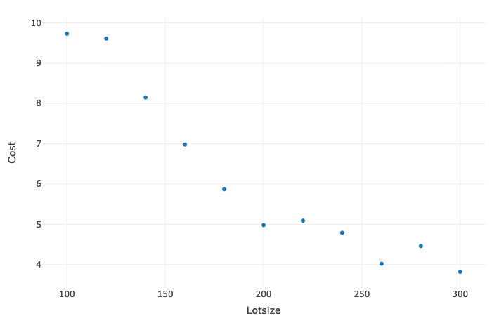
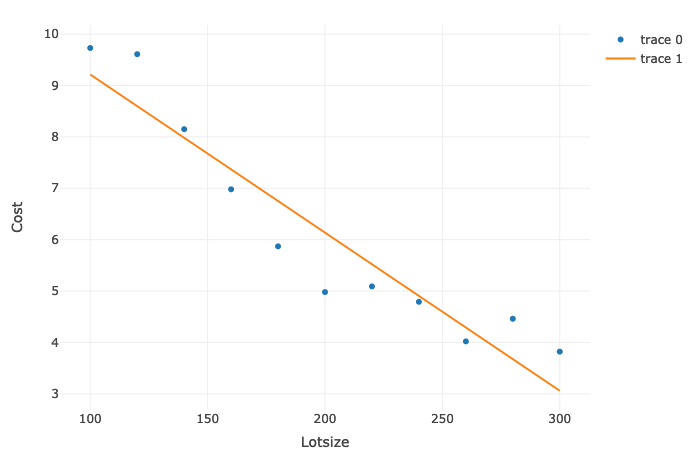
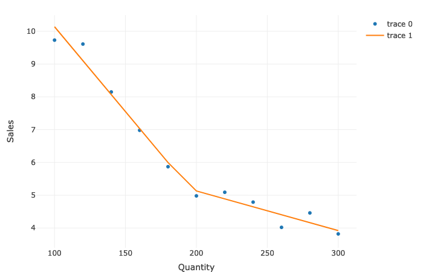

#### Question 1

```R
    # Import the libraries
    library(plotly)
    library(segmented)

    # Create the dataset:
    Lotsize <- c(100,120,140,160,180,200,220,240,260,280,300)
    Cost <- c(9.73,9.61,8.15,6.98,5.87,4.98,5.09,4.79,4.02,4.46,3.82)
    data <- data.frame(Lotsize,Cost)

    # Visalize the dataset:
    plot_ly(data,x=~Lotsize, y=~Cost, type="scatter")

    # Fit a linear regression
    fit <- lm(Cost ~ Lotsize, data=data)
    summary(fit)

    # Output
    # Residuals:
    #     Min      1Q  Median      3Q     Max 
    # -1.1564 -0.4091 -0.1154  0.6386  1.0118 

    # Coefficients:
    #             Estimate Std. Error t value Pr(>|t|)    
    # (Intercept) 12.290909   0.749146  16.407 5.17e-08 ***
    # Lotsize     -0.030773   0.003571  -8.616 1.22e-05 ***
    # ---
    # Signif. codes:  0 ‘***’ 0.001 ‘**’ 0.01 ‘*’ 0.05 ‘.’ 0.1 ‘ ’ 1

    # Residual standard error: 0.7491 on 9 degrees of freedom
    # Multiple R-squared:  0.8919,    Adjusted R-squared:  0.8799 
    # F-statistic: 74.24 on 1 and 9 DF,  p-value: 1.218e-05


    # Visalize the linear regression fit:
    plot_ly(data,x=~Lotsize, 
                y=~Cost, 
                type="scatter") %>% add_lines(x = ~Lotsize, y = fitted(fit))

    # Xbar here is called the Knot value.
    # Using Xbar = 200, manipulate the data
    data$Xbar <- ifelse(data$Lotsize>200,1,0)
    data$diff <- data$Lotsize - 200
    data$X <- data$diff*data$Xbar

    data
    
    # Output:
    #   Lotsize Cost    Xbar diff X
    # 1      100 9.73    0 -100   0
    # 2      120 9.61    0  -80   0
    # 3      140 8.15    0  -60   0
    # 4      160 6.98    0  -40   0
    # 5      180 5.87    0  -20   0
    # 6      200 4.98    0    0   0
    # 7      220 5.09    1   20  20
    # 8      240 4.79    1   40  40
    # 9      260 4.02    1   60  60
    # 10     280 4.46    1   80  80
    # 11     300 3.82    1  100 100

    # Fit the linear spline regression
    # The X in the equation below is (x-xbar)*Xk
    reg <- lm(Cost ~ Lotsize + X, data = data)

    plot_ly(data,x=~Lotsize,
            y=~Cost,
            type="scatter") %>% add_lines(x =  ~Lotsize, y = fitted(reg))

    summary(reg)
    
    # Output:

    # Residuals:
    #     Min       1Q   Median       3Q      Max 
    # -0.37596 -0.16641 -0.09677  0.20363  0.51734 

    # Coefficients:
    #             Estimate Std. Error t value Pr(>|t|)    
    # (Intercept) 15.116481   0.535383  28.235 2.67e-09 ***
    # Lotsize     -0.050199   0.003332 -15.065 3.73e-07 ***
    # X            0.038852   0.005946   6.534 0.000181 ***
    # ---
    # Signif. codes:  0 ‘***’ 0.001 ‘**’ 0.01 ‘*’ 0.05 ‘.’ 0.1 ‘ ’ 1

    # Residual standard error: 0.3157 on 8 degrees of freedom
    # Multiple R-squared:  0.9829,    Adjusted R-squared:  0.9787 
    # F-statistic: 230.4 on 2 and 8 DF,  p-value: 8.474e-08

    
    # Above results can also be obtained using Segmented package in R:
    fit_seg <- segmented(fit, seg.Z = ~Quantity, psi = list(Quantity=200))

    plot_ly(data,x=~Quantity,
            y=~Sales,
            type="scatter") %>% add_lines(x =  ~Quantity, y = fitted(fit_seg))

    summary(fit_seg)
    #Output:

    # Estimated Break-Point(s):
    #               Est. St.Err
    # psi1.Quantity 195.766 10.524

    # Meaningful coefficients of the linear terms:
    #             Estimate Std. Error t value Pr(>|t|)    
    # (Intercept) 15.313000   0.753708  20.317 1.75e-07 ***
    # Lotsize     -0.051750   0.005277  -9.807 2.43e-05 ***
    # U1.Quantity  0.039664   0.006615   5.996       NA    
    # ---
    # Signif. codes:  0 ‘***’ 0.001 ‘**’ 0.01 ‘*’ 0.05 ‘.’ 0.1 ‘ ’ 1

    # Residual standard error: 0.3337 on 7 degrees of freedom
    # Multiple R-Squared: 0.9833,  Adjusted R-squared: 0.9762 

    # Convergence attained in 2 iter. (rel. change 1.6406e-15)
```

**Visualize the Dataset**
<p align="left">
  
</p>

**Visalize the linear regression fit**
<p align="left">
  
</p>

**Visalize the spline fit**
<p align="left">
  
</p>

**Comparing Results:**
  
The model using linear spline
$$\hat y = 15.31 − .05x + 0.039(x-200)^1$$

The test 
$$H_0:\beta_{11}=0$$
which gives a t-value = 6.5 and p-value = 0.000

The R2 obtained using simple linear regression fit is  
$$R^2 = 89.19\%$$

The R2 obtained using linear spline fit is  
$$R^2 = 98.3\%$$

Hence the data support the use
of linear spline model