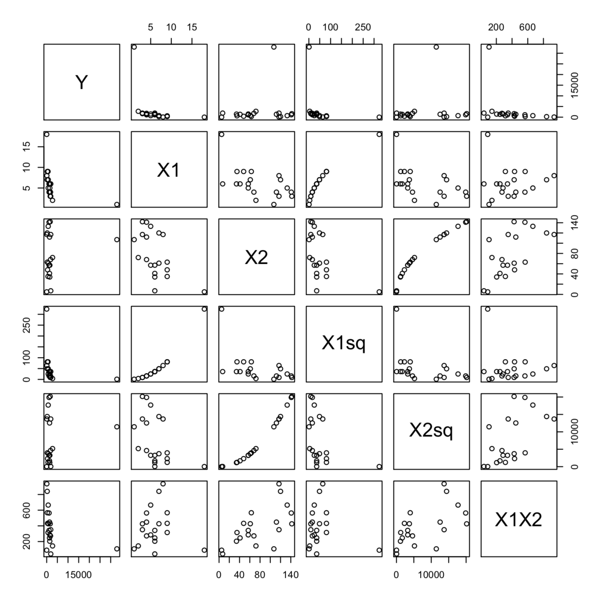
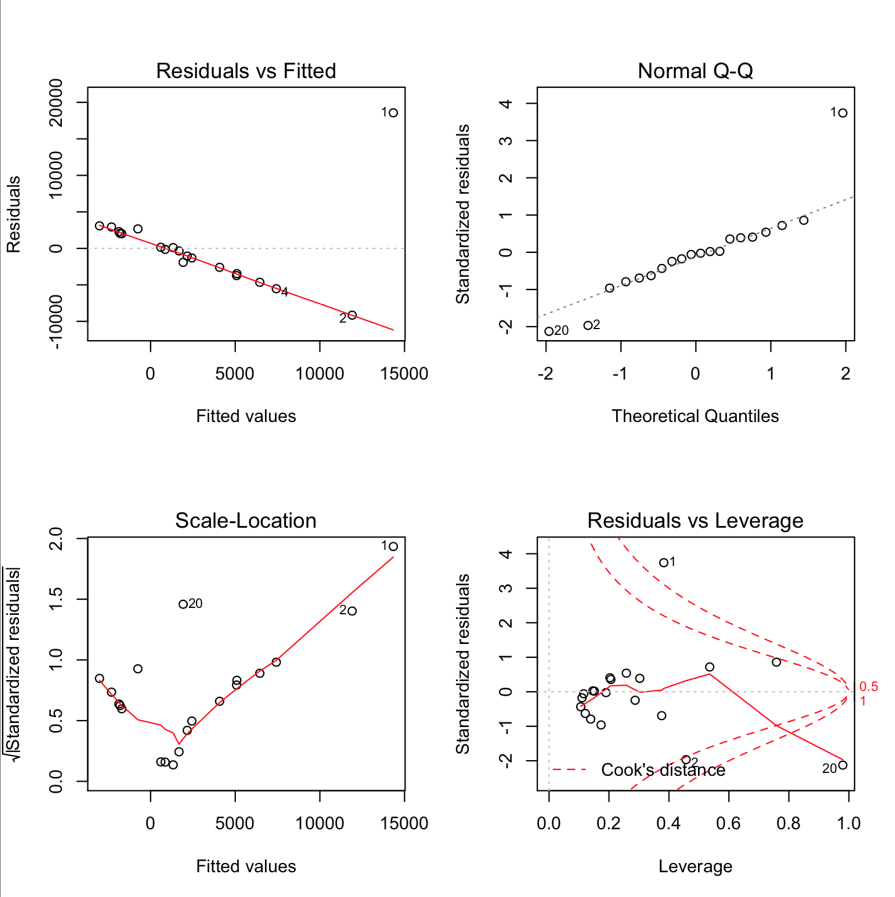
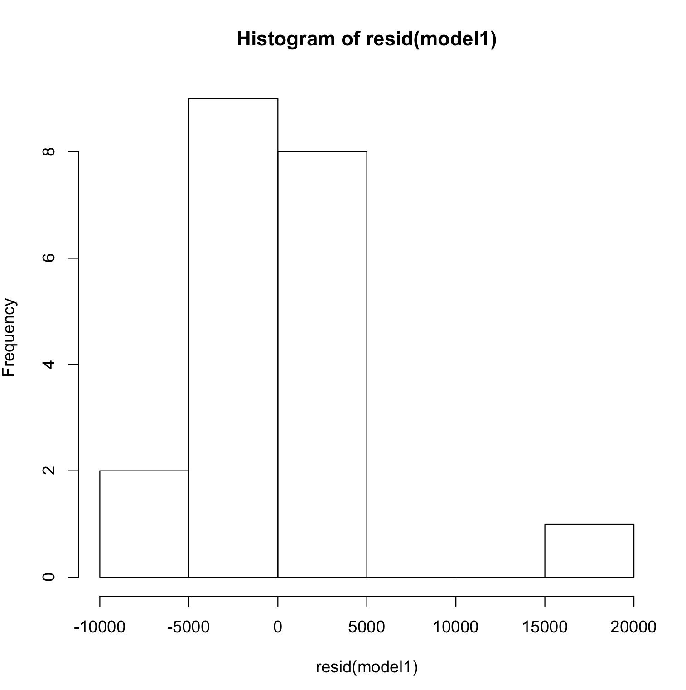

```R
# Read data from csv
data <- read_csv("MidReg.csv")

# Fit data to linear model
model1 <- lm(Y ~ X1 + X2 + X1sq + X2sq + X1X2, data = data)

# Print the model summary
summary(model1)

## Output

# Residuals:
#     Min      1Q  Median      3Q     Max 
# -9155.4 -2811.0  -246.6  2111.6 18567.8 

# Coefficients:
#               Estimate Std. Error t value Pr(>|t|)
# (Intercept) 13586.4511 22793.3837   0.596    0.561
# X1          -3434.5077  4282.7845  -0.802    0.436
# X2            128.6019   306.3080   0.420    0.681
# X1sq          153.7078   172.0089   0.894    0.387
# X2sq           -0.8221     1.1751  -0.700    0.496
# X1X2           -2.9469    28.2256  -0.104    0.918

# Residual standard error: 6317 on 14 degrees of freedom
# Multiple R-squared:  0.4243,    Adjusted R-squared:  0.2187 
# F-statistic: 2.064 on 5 and 14 DF,  p-value: 0.1312

# a scatterplot matrix which include all the variables in the data set.
pairs(data)

# matrix of correlations between the variables
cor(data)

# diagnostic plots of the linear regression fit
plot(hist(resid(model1)))
plot(density(resid(model1)))

par(mfrow = c(2, 2))
plot(model1)

durbinWatsonTest(model1)

# Add new data to data frame
newdat <- data.frame(
            X1 = c(10),
            X2 = c(50), 
            X1sq = c(100),
            X2sq = c(2500),
            X1X2 = c(500))

# Find confidence interval for new data
predict(model1, newdat, se.fit = TRUE, interval = "prediction", level = 0.95)

## Output
#         fit       lwr      upr
# 1 -2486.352 -17426.63 12453.93

```
---------------
### Building a regression model

The regreesion equation is

$$\hat y = 13586.45 - 3434.50X1 + 128.60 X2 + 153.70X1^2  - 0.82X2^2-2.94X1X2$$

---------------

### A scatterplot matrix which include all the variables in the data set.

<p align="left">
  
</p>

----------------

### A matrix of correlations between the variables using the function cor().

|      | Y          | X1         | X2         | X1sq       | X2sq       | X1X2       |
| ---- | ---------- | ---------- | ---------- | ---------- | ---------- | ---------- |
| Y    | 1.0000000  | -0.3999711 | 0.1643805  | -0.2232182 | 0.1257125  | -0.3270220 |
| X1   | -0.3999711 | 1.0000000  | -0.5591696 | 0.9457918  | -0.4648557 | 0.0261422  |
| X2   | 0.1643805  | -0.5591696 | 1.0000000  | -0.5059089 | 0.9713854  | 0.6355347  |
| X1sq | -0.2232182 | 0.9457918  | -0.5059089 | 1.0000000  | -0.3940867 | -0.1371812 |
| X2sq | 0.1257125  | -0.4648557 | 0.9713854  | -0.3940867 | 1.0000000  | 0.5961395  |
| X1X2 | -0.3270220 | 0.0261422  | 0.6355347  | -0.1371812 | 0.5961395  | 1.0000000  |

------------------

### Diagnostic plots of the linear regression fit

- Plot 1:
  
<p align="left">
  
</p>

 - **Residuals vs Fitted:**
The plot of residuals versus fitted values indicates linearity in the data. A horizontal line, without distinct patterns is an indication for a linear relationship. And this model seems to have a pattern fitted with the residuals and fitted values. And it indicates a non-linear relationship in the data.

 - **Normal Q-Q:**
This plot is used to examine whether the residuals are normally distributed. It’s good if residuals points follow the straight dashed line. And this model has its residuals normally distributed.

 - **Scale-Location (or Spread-Location):** This plot is used to check the homogeneity of variance of the residuals (homoscedasticity). Horizontal line with equally spread points is a good indication of homoscedasticity. This is not the case in this model and hence the model has a heteroscedasticity problem.

 - **Standardized Residuals vs Leverage:** This plot is used to identify influential cases (outliers), that is extreme values that might influence the regression results when included or excluded from the analysis. This plot of standardized residuals versus leverage indicates the presence of a 2 outliers (point 1 and point 2)

- Plot 2:

<p align="left">
  
</p>

The above plot helps to determine if the residual errors if this model are normally distributed.

- Durbin Watson Test:
  
| lag | Autocorrelation | D-W Statistic | p-value |
| --- | --------------- | ------------- | ------- |
| 1   | -0.1024956      | 1.581364      | 0.132   |
Alternative hypothesis: rho != 0

The p-value of the Durbin-Watson test is 0.1. It is small and casts doubt on the validity of the null hypothesis and indicates autocorrelation among residuals.

-------------

### 95% Prediction Interval for new data

$$PI_{95\%}  = (-17426.63, 12453.93)$$ 

-------------